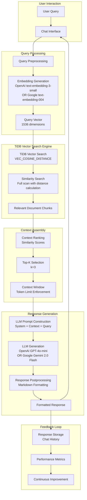
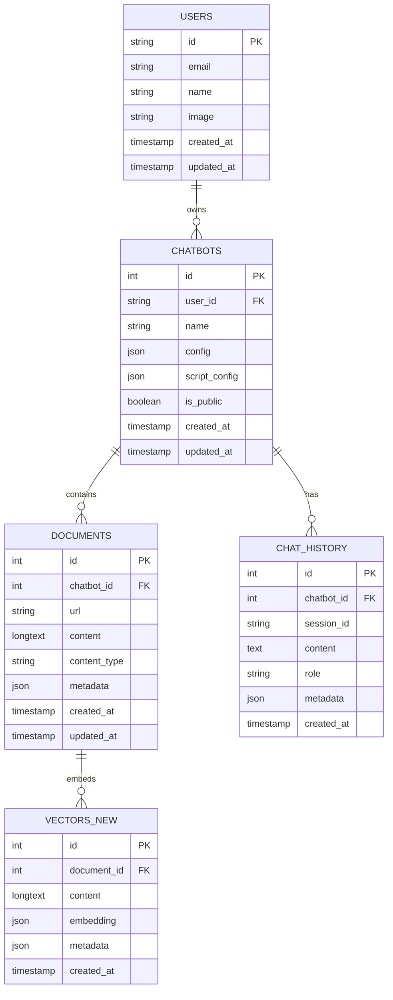
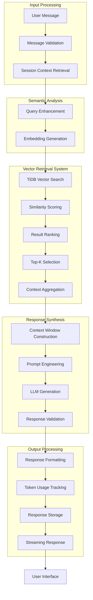
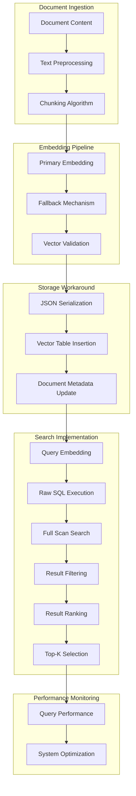

# Claw - AI Chatbot Maker with TiDB Vector Search

This project is an AI-powered chatbot builder that allows users to create custom chatbots from documentation sites or GitHub repositories using TiDB Vector Search. It was built for the TiDB Cloud Vector Search Hackathon.

## Features

- **Data Ingestion**: Import content from documentation websites or GitHub repositories
- **Vector Search**: Leverages TiDB's native vector search capabilities for semantic similarity
- **Custom Chatbots**: Create multiple chatbots for different use cases
- **Embeddable Widget**: Generate a script tag to embed your chatbot on any website
- **Dashboard**: Manage your chatbots through an intuitive interface

## Tech Stack

- **Frontend**: Next.js 15, React 19, TypeScript, Tailwind CSS
- **Backend**: Next.js API Routes
- **Database**: TiDB Serverless with Vector Search
- **Authentication**: Clerk
- **ORM**: Drizzle ORM
- **AI Services**: OpenAI API and Google Gemini for embeddings and completions
- **UI Components**: Radix UI, Shadcn UI

## TiDB Architecture Overview

### Advanced RAG (Retrieval-Augmented Generation) System



### Comprehensive Data Pipeline

```mermaid
flowchart TB
    subgraph "Data Sources"
        A1[Documentation Websites] --> B[Ingestion Service]
        A2[GitHub Repositories] --> B
        A3[Text Documents] --> B
    end
    
    subgraph "Document Processing Pipeline"
        B --> C[Content Extraction<br/>HTML/PDF Parsing]
        C --> D[Text Cleaning<br/>Noise Removal]
        D --> E[Metadata Extraction<br/>Title, URL, Timestamp]
    end
    
    subgraph "Chunking Strategy"
        E --> F[Sentence-based Splitting<br/>Chunk Size: 1000 chars<br/>Context-aware Overlap]
        F --> G[Chunk Metadata<br/>Source, Position, Hash]
    end
    
    subgraph "Embedding Generation"
        G --> H[Embedding Generation<br/>OpenAI text-embedding-3-small (primary)<br/>Google text-embedding-004 (fallback)]
        H --> I[Vector Representation<br/>1536 dimensions]
    end
    
    subgraph "TiDB Storage Layer"
        I --> J[JSON Vector Storage<br/>Workaround for Drizzle ORM limitations]
        J --> K[Vector Table Insertion<br/>vectors_new Table]
        K --> L[Document Table Update<br/>documents Table]
    end
    
    subgraph "Monitoring & Analytics"
        L --> M[Processing Metrics<br/>Throughput, Latency]
        M --> N[Data Quality Checks<br/>Validation, Deduplication]
        N --> O[Performance Dashboard<br/>Real-time Monitoring]
    end
```

### Detailed Database Schema with TiDB Features



### Intelligent AI Agent Workflow



### Current Vector Implementation Process



## TiDB Vector Search Implementation

### Current Vector Storage (Workaround)
```sql
CREATE TABLE vectors_new (
  id BIGINT PRIMARY KEY AUTO_INCREMENT,
  document_id BIGINT,
  content TEXT,
  embedding JSON,  -- JSON storage due to Drizzle ORM limitations
  metadata JSON,
  created_at TIMESTAMP DEFAULT CURRENT_TIMESTAMP
);
```

### Vector Search Query
```sql
SELECT 
  v.id,
  v.document_id as documentId,
  v.content,
  VEC_COSINE_DISTANCE(v.embedding, '[1, 2, 3, ...]') as similarity
FROM vectors_new v
INNER JOIN documents d ON v.document_id = d.id
WHERE d.chatbot_id = 1
ORDER BY similarity
LIMIT 3;
```

### Current Implementation Details
- **Vector Dimensions**: 1536 (OpenAI text-embedding-3-small)
- **Storage Format**: JSON (due to Drizzle ORM limitations with native VECTOR type)
- **Search Method**: Full table scan with VEC_COSINE_DISTANCE calculation
- **Indexing**: No native HNSW index yet due to ORM limitations
- **Future Plans**: Migrate to native VECTOR type when Drizzle ORM supports it

## Architecture

### Database Schema

The application uses TiDB with the following tables:

1. **users**: User accounts from Clerk
2. **chatbots**: User-created chatbots with configuration
3. **documents**: Ingested content from websites or repositories
4. **vectors_new**: Vector embeddings of document chunks (using JSON storage)
5. **chat_history**: Conversation history for each chatbot

### Vector Search Implementation

- Uses TiDB's native `VEC_COSINE_DISTANCE` function for similarity calculations
- Implements fallback mechanisms for both embedding generation and LLM responses
- Uses raw SQL queries to access TiDB's vector functions due to ORM limitations
- Plans to implement native HNSW indexes when ORM support is available

### Multi-Cluster Placement

- Implements data placement policies for performance optimization
- Distributes data across regions for disaster recovery

## Getting Started

### Prerequisites

- Node.js 18+
- TiDB Cloud account
- OpenAI API key (primary) OR Google Generative AI API key (fallback)
- Clerk account
- GitHub Personal Access Token (for GitHub repository ingestion - optional)

### Installation

1. Clone the repository:
   ```bash
   git clone <repository-url>
   cd ai-chatbot-maker
   ```

2. Install dependencies:
   ```bash
   bun install
   ```

3. Set up environment variables:
   ```bash
   cp .env.example .env
   ```
   
   Update the `.env` file with your:
   - Clerk credentials
   - TiDB connection string
   - OpenAI API key (or Google Generative AI API key)
   - GitHub Personal Access Token (optional, for GitHub repository ingestion)

4. Run database migrations:
   ```bash
   bun run db:push
   ```

5. Start the development server:
   ```bash
   bun run dev
   ```

## Usage

1. **Create a Chatbot**: Use the dashboard to create a new chatbot
2. **Ingest Data**: Add documentation websites or GitHub repositories
3. **Configure Widget**: Customize the appearance and behavior of your chatbot widget
4. **Embed on Website**: Copy the generated script tag and add it to your website

## API Endpoints

- `POST /api/chatbots` - Create a new chatbot
- `GET /api/chatbots` - List all chatbots for the user
- `GET /api/chatbots/[id]` - Get details for a specific chatbot
- `PUT /api/chatbots/[id]` - Update a chatbot
- `DELETE /api/chatbots/[id]` - Delete a chatbot
- `POST /api/chatbots/[id]/ingest` - Ingest a document for a chatbot
- `GET /api/chatbots/[id]/ingest` - List documents for a chatbot
- `POST /api/chatbots/[id]/chat` - Chat with a chatbot
- `GET /api/chatbots/[id]/chat` - Get chat history
- `GET /api/chatbots/[id]/script` - Get the embed script for a chatbot
- `PUT /api/chatbots/[id]/script` - Update script configuration

## Hackathon Requirements Fulfillment

This project fulfills all hackathon requirements:

1. **Integrates TiDB Vector**: Uses TiDB's native vector search capabilities with VEC_COSINE_DISTANCE
2. **Combines at least two components**:
   - Data ingestion (websites and GitHub repositories)
   - Vector search with TiDB
   - LLM calls for chat completions
3. **Real-world problem solving**: Enables businesses to create AI assistants from their existing documentation

## Future Enhancements

- Implement native VECTOR type when Drizzle ORM supports it
- Add HNSW indexing for improved search performance
- Implement GitHub repository integration
- Add support for PDF and other document types
- Improve chunking algorithms for better context
- Add analytics dashboard
- Implement domain verification for widget security
- Add more customization options for the chat widget

## Contributing

Contributions are welcome! Please feel free to submit a Pull Request.

## License

This project is licensed under the MIT License.